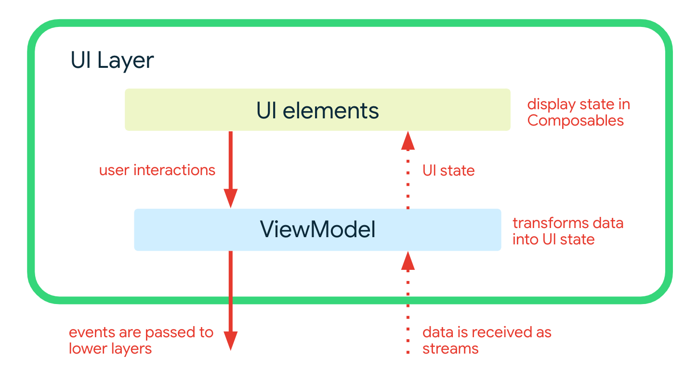

# Android 架构学习

本 `demo` 参考官方文档 [App architecture](https://developer.android.google.cn/topic/architecture/intro) 及官方示例 [Now in Android](https://github.com/android/nowinandroid) 实现，后续会慢慢完善本demo，计划复刻一个 [Now in Android](https://github.com/android/nowinandroid) 来。

## 一、模块化
- 本demo暂时没做模块化，但是本demo文件结构是参考模块化的结构创建的，方便后续转成模块化，见下图
- 关于模块化，可以参考 [Now in Android](https://github.com/android/nowinandroid) 和 [Android app modularization](https://developer.android.google.cn/topic/modularization)。

## 二、架构概述
本 demo 架构有三层： [data layer](https://developer.android.com/jetpack/guide/data-layer)、 [domain layer](https://developer.android.com/jetpack/guide/domain-layer) 和 [UI layer](https://developer.android.com/jetpack/guide/ui-layer).

### （一）示例
在 [Now in Android](https://github.com/android/nowinandroid) 中，ForYouScreen 界面的数据显示流程如下：

### （二）Data layer
数据层是作为应用数据和业务逻辑的离线优先来源实现的。它是应用程序中所有数据的真实来源。

### （三）Domain layer
略

### （四）UI layer
[UI layer](https://developer.android.com/topic/architecture/ui-layer) 包括:
*   UI elements built using [Jetpack Compose](https://developer.android.com/jetpack/compose)
*   [Android ViewModels](https://developer.android.com/topic/libraries/architecture/viewmodel)

## TODO：
1. 关于官方推荐的现代架构，需要后续补充完善架构代码。
2. 关于`HomeScreen`界面，`Compose`相关代码需要优化。